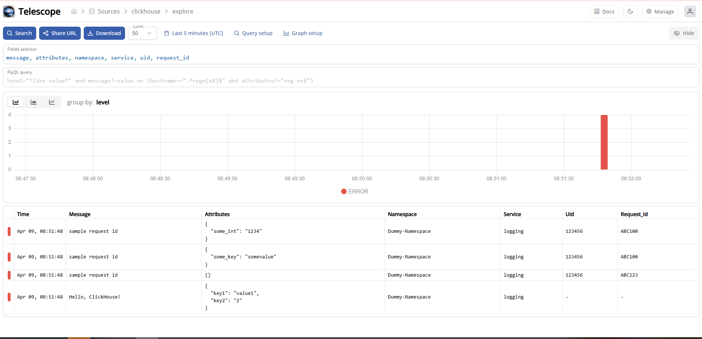

# slog-clickhouse
A modified ClickHouse Handler for slog Go library. with the support of additional information, 

- Changed `attrs: String` to `attributes: Map(String, String)` for better performance and easier querying.

- `uid` and `request_id` are optional fields. If provided, they will be automatically mapped:
  - Any of `uid`, `user_id`, or `userID` → stored in the `uid` column.
  - Any of `rid`, `request_id`, or `requestID` → stored in the `request_id` column.

- All other key-value pairs in `attributes` will be stored as strings.


## Installation

```bash
go get github.com/smllnest/slog-clickhouse
```

**Compatibility**: `go >= 1.21`

## Usage

### Handler options

```go
type Option struct {
	// log level (default: debug)
	Level slog.Leveler

	// ClickHouse connection
	DB       *sql.DB
	LogTable string
	Timeout  time.Duration // default: 60s

    // Few additional attributes for logging.
	Namespace string
	Service   string

	// optional: customize clickhouse event builder
	Converter Converter

	// optional: see slog.HandlerOptions
	AddSource   bool
	ReplaceAttr func(groups []string, a slog.Attr) slog.Attr
}
```

Other global parameters:
```go
slogclickhouse.SourceKey = "source"
slogclickhouse.ContextKey = "extra" // this has been removed for querying in clickhouse
slogclickhouse.RequestKey = "request"
slogclickhouse.ErrorKeys = []string{"error", "err"}
slogclickhouse.RequestIgnoreHeaders = false
```

### Supported attributes
The following attributes are interpreted by slogclickhouse.DefaultConverter:

|Atribute name|	slog.Kind|	Underlying type|
|---|---|---|
|"error"|	any|	error|
|"request"|	any|	*http.Request|
|other attributes	|*	||


Other attributes will be injected in extra field.

### Example


You must create the table before using it, or use the docker-compose to auto initialize the schema:
```sh
CREATE DATABASE IF NOT EXISTS logging;

CREATE TABLE IF NOT EXISTS logging.logs (
   timestamp DateTime,
   level String,
   message String,
   hostname String,
   attributes Map(String, String),
   namespace String,
   service String,
   uid Nullable(Int32) DEFAULT NULL,
   request_id  Nullable(String) DEFAULT NULL
) ENGINE = MergeTree()
PARTITION BY toYYYYMM(timestamp)
ORDER BY (timestamp)
TTL timestamp + INTERVAL 1 WEEK DELETE;
```

then run the below code:

```go
package main

import (
	"log/slog"
	"testing"
	"time"

	"github.com/smallnest/slog-clickhouse"
)

func main() {
	conn := clickhouse.OpenDB(&clickhouse.Options{
		Addr: []string{"127.0.0.1:9001"},
		Auth: clickhouse.Auth{
			Database: "logging",
			Username: "",
			Password: "",
		},
		Settings: clickhouse.Settings{
			"max_execution_time": 60,
		},
		DialTimeout:          time.Second * 30,
		Debug:                true,
		BlockBufferSize:      10,
		MaxCompressionBuffer: 10240,
	})

	if err := conn.Ping(); err != nil {
		t.Log("local clickhouse server is not running, skipping test...")
		return
	}

	conn.SetMaxIdleConns(5)
	conn.SetMaxOpenConns(10)
	conn.SetConnMaxLifetime(time.Hour)

	chHandler := Option{
		Level:     slog.LevelWarn,
		DB:        conn,
		LogTable:  "logging.logs",
		Namespace: "Dummy-Namespace",
		Service:   "logging",
	}.NewClickHouseHandler()

	logger := slog.New(chHandler)

	logger.Info("Hello, ClickHouse!", "key1", "value1", "key2", 2)
	logger.Error("sample request id and uid", "uid", 123456, "request_id", "ABC123")
	logger.Error("sample request id, uid and other string", "uid", 123456, "request_id", "ABC100", "some_key", "somevalue")
	logger.Error("sample request id, uid and other integer", "uid", 123456, "request_id", "ABC100", "some_int", 1234)
}
```

## Docker compose setup

### Setup

### Docker Setup

The `docker-compose.yml` is configured to run both **ClickHouse** and **Telescope**.

To start the containers:

```bash
docker-compose up -d
```

#### ClickHouse

- On startup, ClickHouse will execute the script at `clickhouse-init/init-logging-schema.sql`.
- This script creates the default database and a table for storing logs.

#### Telescope

- After the containers are running, open the Telescope URL in your browser.
- You’ll be guided to set the initial **admin password** and configure the **logs source**.

## Check the result in ClickHouse:

Clickhouse can be accessed via following command if running it through docker. 

```shell
docker exec -it clickhouse clickhouse-client
```


## Check the results in Telescope

log into the telescope and open the clickhouse based logs source. 



more information about telescope could be found here https://github.com/iamtelescope/telescope

